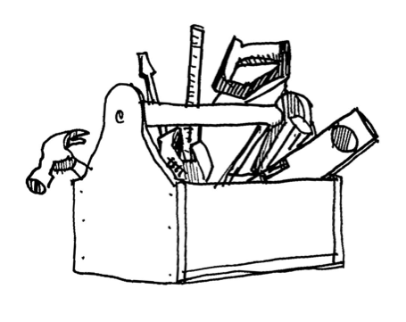

## The Sensitivity Analysis For Everybody (SAFE) Toolbox ##

The SAFE Toolbox provides a set of functions to perform Global Sensitivity Analysis. 
It implements several methods, including the Elementary Effects Test, Regional Sensitivity Analysis,
Variance-Based (Sobol’) sensitivity analysis and the PAWN method.  
SAFE was originally developed for the Matlab/Octave environment (Pianosi et al 2015) 
but is now available also in R and Python. An overview of the community of SAFE users 
and their evaluation of SAFE can be found in Pianosi et al (2020).

### Download ###

The SAFE Toolbox is available on GitHub in three versions:
* [Matlab version](https://github.com/SAFEtoolbox/SAFEtoolbox/tree/master/SAFE-matlab/)
* [Python version](https://github.com/SAFEtoolbox/SAFEtoolbox/tree/master/SAFE-python/)
* [R version](https://github.com/SAFEtoolbox/SAFEtoolbox/tree/master/SAFE-R/)

Use SAFE freely but please cite the paper [Pianosi et al. 2015](/index#references) in any publication
presenting results obtained using SAFE.

### Learn more ###

* [Scientific and technical documentation](./Documentation.md/)
* [Applications](./Applications.md/)
* [PAWN method](./Pawn.md/)
* [Frequently Asked Questions](./Faqs.md/)

<!--
### Install iRONS locally ###
To install iRONS on your computer: [Install iRONS](./Install.md/)
-->

### References ###
Pianosi, F., Sarrazin, F., Wagener, T. (2015), A Matlab toolbox for Global Sensitivity Analysis, Environmental Modelling 
& Software, 70, 80-85. [doi.org/10.1016/j.envsoft.2015.04.009](https://doi.org/10.1016/j.envsoft.2015.04.009)

Pianosi, F., Wagener, T., Sarrazin, F. (2020), How successfully is open-source research software adopted? Results and implications of surveying the users of a sensitivity analysis toolbox, Environmental Modelling & Software, 124. [doi.org/10.1016/j.envsoft.2019.104579](https://doi.org/10.1016/j.envsoft.2019.104579)

### License
This software is distributed under the GNU Public License Version 3. 
See [www.gnu.org/licenses/gpl-3.0.en.html](https://www.gnu.org/licenses/gpl-3.0.en.html) for details.

### Contributors ###

SAFE was originally developed in Matlab by Francesca Pianosi, Fanny Sarrazin and Thorsten Wagener 
at the Department of Civil Engineering at the University of Bristol. The R version was developed
by Isabella Gollini and Valentina Noacco. The Python Jupyter Notebooks were developed by
Andres Penuela-Fernandez.

### Acknowledgements ###

The development of SAFE was originally supported by the UK Natural Environment Research Council 
through the Consortium on Risk in the Environment: Diagnostics, Integration, Benchmarking, Learning 
and Elicitation (CREDIBLE) [NE/J017450/1].
The further development of SAFE, including the implementation of the Python version, 
has been supported by the UK Engineering and Physical Sciences Research Council through 
a Living with Environmental Change Fellowship [EP/R007330/1] and the EPSRC Impact Acceleration Account.

<!--&nbsp;

   

-->
